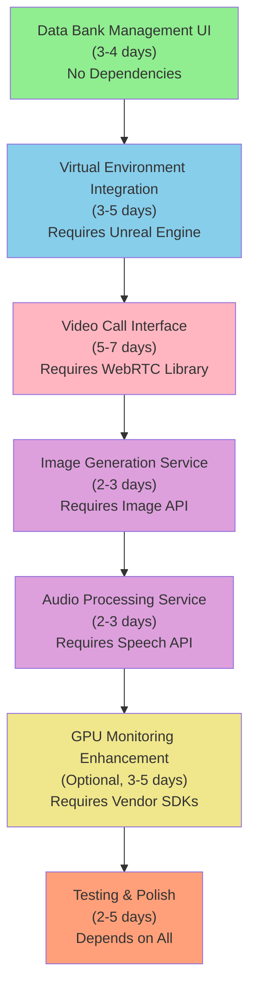

# House Victoria - Development Roadmap & Documentation

**Generated:** January 2025  
**Version:** 2.0  
**Status:** Development Phase - ~75% Complete

---

## Table of Contents

1. [Project Overview](#project-overview)
2. [Module Architecture](#module-architecture)
3. [Completed Features](#completed-features)
4. [Remaining Development Tasks](#remaining-development-tasks)
5. [Prioritized Development Roadmap](#prioritized-development-roadmap)
6. [Implementation Guidelines](#implementation-guidelines)
7. [Risk Mitigation](#risk-mitigation)
8. [Success Metrics](#success-metrics)

---

## Project Overview

House Victoria is a modular desktop overlay application inspired by Xbox Game Bar. It provides multimodal AI chat, SMS/MMS communication, project management, system monitoring, and virtual environment integration.

**Current Status:** Core infrastructure complete, most primary features implemented (~75% complete)

**Architecture:** WPF (.NET 8.0) with MVVM pattern, dependency injection, event aggregator, SQLite database

---

## Module Architecture

### Core Services (10 Services)

| Service | Location | Status | Description |
|---------|----------|--------|-------------|
| **IAIService** | `Services/AIServices/` | ✅ Complete | Ollama/LlamaCpp AI integration, persona management, LLM parameters |
| **ICommunicationService** | `Services/Communication/` | ✅ Complete | SMS/MMS messaging with full media support |
| **IPersistenceService** | `Services/Persistence/` | ✅ Complete | SQLite database with Dapper, full CRUD |
| **IProjectManagementService** | `Services/ProjectManagement/` | ✅ Complete | Full project management with roadblocks, artifacts, AI logs |
| **ISystemMonitorService** | `Services/SystemMonitor/` | 🚧 Partial | CPU/RAM/temperature (WMI), GPU metrics limited |
| **IVirtualEnvironmentService** | `Services/VirtualEnvironment/` | ❌ Scaffold | Unreal Engine WebSocket (not connected) |
| **ILoggingService** | `Services/Logging/` | ✅ Complete | Serilog integration, categorized logging |
| **IFileGenerationService** | `Services/FileGeneration/` | ✅ Complete | AI-generated file management |
| **IMCPService** | `Services/MCP/` | ✅ Complete | MCP server integration for autonomous agents |
| **IMemoryService** | `Services/Persistence/` | ✅ Complete | Persistent memory via database |

### UI Modules

| Module | Location | Status | Key Features |
|--------|----------|--------|--------------|
| **Main Tray** | `App/Screens/Trays/MainTray.xaml` | ✅ Complete | Bottom-right overlay, window launcher buttons |
| **Top Tray** | `App/Screens/Trays/TopTray.xaml` | ✅ Complete | Drag-drop file upload, generated files, projects button |
| **System Monitor Drawer** | `App/Screens/Trays/SystemMonitorDrawer.xaml` | 🚧 Partial | CPU/RAM metrics, server management (GPU limited by WMI) |
| **SMS/MMS Window** | `App/Screens/Windows/SMSMMSWindow.xaml` | ✅ Complete | Chat interface, media attachments (images/video/audio/docs), conversations |
| **AI Models Window** | `App/Screens/Windows/AIModelsWindow.xaml` | ✅ Complete | Persona management, model loading/pulling, LLM parameters |
| **Settings Window** | `App/Screens/Windows/SettingsWindow.xaml` | ✅ Complete | All config sections, validation, connection testing, import/export |
| **Projects Window** | `App/Screens/Windows/ProjectsWindow.xaml` | ✅ Complete | Full CRUD, filtering, sorting, detail dialogs, roadblocks, artifacts |
| **Global Log Directory** | `App/Screens/Windows/GlobalLogDirectoryWindow.xaml` | ✅ Complete | Categorized log viewing, export (TXT/JSON/CSV) |

---

## Completed Features

### ✅ Infrastructure (100%)
- Dependency injection container (Microsoft.Extensions.DependencyInjection)
- Event aggregator for loose coupling
- SQLite database with Dapper
- Serilog logging integration
- All 10 service interfaces implemented and functional
- MVVM architecture throughout
- MaterialDesign UI theme with dark mode
- Glass overlay effects with click-through support

### ✅ Communication Module (95%)
- SMS/MMS chat interface with conversation management
- Media attachments (images, videos, audio, documents)
- File picker with type filtering (Images/Videos/Audio/Documents)
- Media preview in message bubbles
- File size validation (50MB maximum)
- Pending attachment preview and removal
- AI contact integration with persona loading
- Message timeout handling (5-minute timeout with detailed error messages)
- **Remaining:** Video call interface (see Priority 2)

### ✅ AI Module (100%)
- Ollama service integration
- LlamaCpp service (alternative implementation)
- AI persona creation and management
- Model loading/unloading from Ollama
- Model pulling from Ollama repository
- LLM parameter configuration (Temperature, TopP, TopK, RepeatPenalty, MaxTokens, ContextLength)
- MCP server integration per persona
- System prompt editing
- Contact book management
- Data bank creation per persona

### ✅ Project Management Module (100%)
- Project creation with all fields (name, type, description, priority, dates, phase, AI contact)
- Project list with card-based display
- Filtering by type and phase
- Sorting (name, priority, deadline, completion percentage)
- Project detail dialog with tabs:
  - Overview: Edit project, phase management, completion tracking
  - Roadblocks: Add/remove roadblocks
  - Artifacts: Upload, preview, download, delete files
  - AI Logs: Timeline view with filtering by AI contact and search
- Full CRUD operations
- AI collaboration logging

### ✅ Settings Module (100%)
- LLM server settings (Ollama endpoint, connection testing)
- MCP server settings (endpoint, connection testing)
- TTS settings (endpoint, connection testing)
- Virtual environment settings (Unreal Engine endpoint, connection testing)
- Overlay settings (enable/disable, opacity, auto-hide)
- Avatar settings (model path, voice model, voice speed/pitch)
- Locomotion settings (walk speed, run speed, jump height, physics)
- Tools configuration (file system, network, system commands)
- Persistent memory configuration (enable, path, max entries, importance threshold, retention)
- Settings validation (URL format, numeric ranges, required fields)
- Connection status indicators (per service)
- Settings import/export (JSON format)
- Reset to defaults functionality

### ✅ System Monitoring (80%)
- Real-time CPU usage monitoring (PerformanceCounter)
- Real-time RAM monitoring (PerformanceCounter)
- CPU temperature via WMI (MSAcpi_ThermalZoneTemperature)
- System uptime display
- AI status indicators (Primary AI, Current AI Contact)
- Virtual environment status display
- Server management (Ollama, MCP, TTS, Unreal Engine) with restart/stop controls
- Circuit breaker pattern for unreachable servers
- Auto-hide drawer functionality
- **Limitation:** GPU metrics limited by WMI (CPU fan, GPU usage/temperature/fan return 0.0)

### ✅ File & Data Management
- Drag-and-drop file upload to data banks (Top Tray)
- Text file processing (txt, md, json, xml, csv, log, cs, js, py, html, css)
- Binary file metadata storage
- Automatic "Dropped Files" data bank creation
- Generated files directory access
- Global log directory with categorization

---

## Remaining Development Tasks

### Priority 1: Critical Missing Features (Foundation First)

#### 1. Data Bank Management UI
**Priority:** HIGH  
**Estimated Effort:** 3-4 days  
**Status:** Backend exists (`IMemoryService`), UI missing  
**Dependencies:** None

**Why First:**
- Memory service backend is complete and functional
- Users need UI to manage their data banks
- Required for full utilization of memory system
- No external dependencies (can start immediately)

**Implementation Tasks:**
1. Create `DataBankManagementWindow.xaml` and ViewModel
2. Implement data bank list view with:
   - Display all data banks
   - Show entry counts per bank
   - Search/filter banks by name
3. Add data bank CRUD operations:
   - Create new data bank
   - Edit data bank name/description
   - Delete data bank (with confirmation)
4. Implement data entry viewer/editor:
   - List entries in selected bank
   - View entry details (key, value, category, importance, tags)
   - Add new entries
   - Edit existing entries
   - Delete entries
5. Add search and filtering:
   - Search entries by text
   - Filter by category
   - Filter by importance threshold
6. Integrate with existing `IMemoryService` (via `IPersistenceService`)

**Files to Create:**
- `HouseVictoria.App/Screens/Windows/DataBankManagementWindow.xaml`
- `HouseVictoria.App/Screens/Windows/DataBankManagementWindow.xaml.cs`
- `HouseVictoria.App/Screens/Windows/DataBankManagementWindowViewModel.cs`

**Testing:**
- Test data bank creation and deletion
- Test data entry CRUD operations
- Test search and filtering
- Verify integration with MemoryService

---

#### 2. Virtual Environment Service Integration
**Priority:** HIGH  
**Estimated Effort:** 3-5 days  
**Status:** Service scaffold exists (`UnrealEnvironmentService.cs`), WebSocket not tested  
**Dependencies:** Unreal Engine with WebSocket plugin

**Why Second:**
- Service structure already exists
- Completes core service layer
- Needed for virtual environment features
- Should be done before advanced features

**Implementation Tasks:**
1. **WebSocket Connection:**
   - Test WebSocket connection to Unreal Engine (`ws://localhost:8888`)
   - Implement connection state management (Connected, Disconnected, Connecting, Error)
   - Add connection retry logic with exponential backoff

2. **Connection UI:**
   - Add connection status indicator in System Monitor Drawer
   - Add connection toggle button (Connect/Disconnect)
   - Display connection errors to user

3. **Message Protocol:**
   - Define message format (JSON)
   - Implement message sending
   - Implement message receiving
   - Handle different message types (SceneInfo, AvatarStatus, CommandResponse, etc.)

4. **Error Handling:**
   - Handle connection failures gracefully
   - Implement auto-reconnect logic (with user control)
   - Add timeout handling for commands
   - Log all errors to LoggingService

5. **Scene Information Display:**
   - Display current scene name
   - Display available avatars
   - Display scene objects count

6. **Avatar Spawning Controls:**
   - UI to spawn avatar
   - UI to despawn avatar
   - Display current avatar status

7. **Pose/Movement Controls:**
   - Movement commands (move forward, backward, left, right)
   - Pose commands (idle, walk, run, jump)
   - Movement speed controls

**Files to Modify:**
- `HouseVictoria.Services/VirtualEnvironment/UnrealEnvironmentService.cs`

**Files to Create/Modify:**
- Update `SystemMonitorDrawer.xaml` to add virtual environment controls

**Testing:**
- Test WebSocket connection with Unreal Engine running
- Test connection state transitions
- Test message sending/receiving
- Test error handling and reconnection
- Test avatar spawning and movement

---

### Priority 2: Communication Enhancements (User Value)

#### 3. Video Call Interface
**Priority:** MEDIUM  
**Estimated Effort:** 5-7 days  
**Status:** Not started  
**Dependencies:** WebRTC library or service

**Why Third:**
- Completes communication suite (with text and media already done)
- Requires external WebRTC library (dependency)
- Higher complexity than data bank UI
- Provides significant user value

**Implementation Tasks:**
1. **Research and Select Solution:**
   - Evaluate WebRTC libraries:
     - WebRTC.NET (C# wrapper)
     - Pion (Go-based, could use HTTP API)
     - Cloud services (Twilio, Agora, etc.)
   - Choose best fit for WPF application
   - Consider licensing, ease of integration, documentation

2. **Video Call Window:**
   - Create `VideoCallWindow.xaml`:
     - Local video display area (camera preview)
     - Remote video display area (partner's video)
     - Call controls panel (mute, video toggle, hang up, settings)
     - Connection status indicator
     - Call duration timer

3. **WebRTC Integration:**
   - Implement WebRTC peer connection setup
   - Handle signaling (STUN/TURN servers)
   - Manage video/audio streams
   - Handle connection state changes

4. **Call Controls:**
   - Mute/unmute audio
   - Enable/disable video
   - Hang up call
   - Switch camera (if multiple available)
   - Adjust volume

5. **Integration with CommunicationService:**
   - Add `StartVideoCall()` method to `ICommunicationService`
   - Handle incoming video call requests
   - Integrate with contact system (show call button in SMS/MMS window)
   - Store call history

6. **Error Handling:**
   - Handle connection failures
   - Handle camera/microphone permissions
   - Display user-friendly error messages
   - Graceful degradation if WebRTC unavailable

**Files to Create:**
- `HouseVictoria.App/Screens/Windows/VideoCallWindow.xaml`
- `HouseVictoria.App/Screens/Windows/VideoCallWindow.xaml.cs`
- `HouseVictoria.App/Screens/Windows/VideoCallWindowViewModel.cs`

**Files to Modify:**
- `HouseVictoria.Core/Interfaces/ICommunicationService.cs`
- `HouseVictoria.Services/Communication/SMSMMSCommunicationService.cs`
- `HouseVictoria.App/Screens/Windows/SMSMMSWindow.xaml` (add call button)

**NuGet Packages Needed:**
- WebRTC library (TBD based on selection)

**Testing:**
- Test WebRTC connection between two instances
- Test call controls (mute, video toggle, hang up)
- Test error scenarios (no camera, no microphone, network issues)
- Test call history storage

---

### Priority 3: AI Enhancements (Optional Features)

#### 4. Image Generation Service
**Priority:** MEDIUM (Optional)  
**Estimated Effort:** 2-3 days  
**Status:** Throws `NotImplementedException` in `OllamaAIService.GenerateImageAsync()`  
**Dependencies:** Image generation API or service

**Why Fourth:**
- Enhances AI capabilities
- Multiple implementation options available
- Relatively straightforward implementation
- Can be done independently

**Implementation Options:**
1. **Ollama Vision Models:** Use Ollama's image generation capabilities (if available)
2. **Stable Diffusion API:** Integrate with Stable Diffusion API (local or cloud)
3. **Separate Service:** Use dedicated image generation service endpoint

**Implementation Tasks:**
1. **Select Solution:**
   - Research Ollama image generation support
   - Evaluate Stable Diffusion API options
   - Choose implementation approach

2. **Implement Image Generation:**
   - Implement `GenerateImageAsync()` in `OllamaAIService`
   - Handle prompt processing
   - Handle image generation parameters (size, quality, style)
   - Handle image retrieval and storage

3. **Add UI:**
   - Add image generation tab/panel in AI Models window
   - Prompt input field
   - Parameter controls (size, quality, style)
   - Generate button
   - Preview generated image
   - Save/download generated image

4. **Integration:**
   - Integrate with `FileGenerationService` for storage
   - Add generated images to generated files directory
   - Support sending generated images in SMS/MMS

**Files to Modify:**
- `HouseVictoria.Services/AIServices/OllamaAIService.cs`
- `HouseVictoria.App/Screens/Windows/AIModelsWindow.xaml` (add image generation UI)

**Testing:**
- Test image generation with various prompts
- Test parameter adjustments
- Test image storage and retrieval
- Test integration with file generation service

---

#### 5. Audio Processing Service (Speech-to-Text)
**Priority:** MEDIUM (Optional)  
**Estimated Effort:** 2-3 days  
**Status:** Throws `NotImplementedException` in `OllamaAIService.ProcessAudioAsync()`  
**Dependencies:** Speech-to-text service or library

**Why Fifth:**
- Enhances multimodal capabilities
- Complements text communication
- Can be implemented independently
- Useful for voice queries to AI

**Implementation Options:**
1. **Whisper API:** OpenAI Whisper API (requires API key)
2. **Local Whisper:** Run Whisper locally via Python service
3. **Azure Speech Services:** Microsoft Azure Speech-to-Text
4. **Google Speech API:** Google Cloud Speech-to-Text

**Implementation Tasks:**
1. **Select Solution:**
   - Evaluate options (cost, accuracy, latency, privacy)
   - Choose implementation approach
   - Set up service endpoint/API key

2. **Implement Audio Processing:**
   - Implement `ProcessAudioAsync()` in `OllamaAIService`
   - Handle audio file upload/streaming
   - Handle transcription result processing
   - Handle error cases (unsupported format, connection failures)

3. **Add UI:**
   - Add microphone button in SMS/MMS window
   - Recording controls (start, stop, cancel)
   - Recording indicator (waveform animation)
   - Display transcribed text
   - Option to send transcribed text as message

4. **Integration:**
   - Integrate with SMS/MMS window for voice messages
   - Support audio file upload for transcription
   - Option to use transcription in AI queries

**Files to Modify:**
- `HouseVictoria.Services/AIServices/OllamaAIService.cs`
- `HouseVictoria.App/Screens/Windows/SMSMMSWindow.xaml` (add microphone button)

**NuGet Packages Needed:**
- Depends on selected solution (may need HTTP client or audio processing library)

**Testing:**
- Test audio recording
- Test transcription accuracy
- Test with various audio formats
- Test integration with SMS/MMS window
- Test error handling

---

### Priority 4: System Enhancements (Optional)

#### 6. Enhanced GPU Monitoring (Optional)
**Priority:** LOW  
**Estimated Effort:** 3-5 days  
**Status:** Partial (WMI-based, limited GPU metrics - returns 0.0 for GPU data)  
**Dependencies:** Vendor-specific GPU drivers and SDKs (NVIDIA NVML or AMD ADL SDK)

**Why Last:**
- Current WMI approach is functional and secure (no Windows Defender warnings)
- GPU monitoring is a "nice to have" feature
- Requires vendor-specific SDKs (additional dependency)
- Only needed if full GPU metrics are critical for users

**Current Limitations:**
- GPU Usage: Returns 0.0 (WMI doesn't provide GPU usage)
- GPU Temperature: Returns 0.0 (WMI doesn't provide GPU temperature)
- GPU Fan Speed: Returns 0.0 (WMI doesn't provide GPU fan speed)
- CPU Fan Speed: Returns 0.0 (WMI doesn't provide CPU fan speed)

**Implementation Options:**
1. **NVIDIA NVML:** NVIDIA Management Library for NVIDIA GPUs
2. **AMD ADL SDK:** AMD Display Library SDK for AMD GPUs
3. **Hybrid Approach:** Use vendor SDKs with WMI fallback

**Implementation Tasks:**
1. **Research and Select:**
   - Research NVIDIA NVML NuGet packages
   - Research AMD ADL SDK integration options
   - Plan hybrid approach with fallback

2. **Implement GPU Monitoring:**
   - Detect GPU vendor (NVIDIA/AMD/Intel/Other)
   - Load appropriate SDK/library
   - Implement GPU usage reading
   - Implement GPU temperature reading
   - Implement GPU fan speed reading
   - Add fallback to WMI for unsupported systems

3. **Update SystemMonitorService:**
   - Modify `GetGpuUsageAsync()` method
   - Modify `GetGpuTemperatureAsync()` method
   - Modify `GetGpuFanSpeedAsync()` method
   - Add GPU vendor detection
   - Add SDK initialization and cleanup

4. **Update UI:**
   - Display GPU vendor in System Monitor Drawer
   - Show accurate GPU metrics when available
   - Show "N/A" or "Not Supported" when unavailable

5. **Testing:**
   - Test with NVIDIA GPU (if available)
   - Test with AMD GPU (if available)
   - Test with Intel integrated graphics (fallback)
   - Test on systems without GPU monitoring SDKs

**Files to Modify:**
- `HouseVictoria.Services/SystemMonitor/SystemMonitorService.cs`
- `HouseVictoria.Services/SystemMonitor/NvmlWrapper.cs` (may need update)

**NuGet Packages Needed:**
- NVIDIA NVML wrapper (if using NVIDIA)
- AMD ADL SDK wrapper (if using AMD)

**Note:** This is optional. Current WMI-based approach is acceptable for most users. Only implement if GPU monitoring is critical requirement.

---

## Prioritized Development Roadmap

### Phase 1: Foundation Completion (Week 1-2)
**Goal:** Complete core functionality gaps with no external dependencies

**Week 1:**
1. **Data Bank Management UI** (3-4 days)
   - No dependencies
   - Enables full memory system utilization
   - Immediate user value

2. **Virtual Environment Integration** (start - 2 days)
   - Complete service layer
   - Begin WebSocket connection testing

**Week 2:**
1. **Virtual Environment Integration** (continue - 3 days)
   - Complete WebSocket connection
   - Implement message protocol
   - Add UI controls

**Deliverables:**
- ✅ Functional data bank management window
- ✅ Working Unreal Engine WebSocket connection
- ✅ Virtual environment controls in System Monitor

**Success Criteria:**
- Users can create, view, edit, and delete data banks
- Users can manage data entries in banks
- Virtual environment connects successfully
- Avatar spawning works (if Unreal Engine available)

---

### Phase 2: Communication Suite (Week 3-4)
**Goal:** Complete all communication features

**Week 3:**
1. **Video Call Interface** (start - 4 days)
   - Research and select WebRTC solution
   - Create VideoCallWindow
   - Begin WebRTC integration

**Week 4:**
1. **Video Call Interface** (continue - 3 days)
   - Complete WebRTC integration
   - Add call controls
   - Integrate with CommunicationService
   - Testing and bug fixes

**Deliverables:**
- ✅ Working video calling capability
- ✅ Video call window with all controls
- ✅ Integration with SMS/MMS window

**Success Criteria:**
- Users can initiate video calls from SMS/MMS window
- Video and audio streams work correctly
- All call controls function properly
- Error handling works gracefully

---

### Phase 3: AI Enhancements (Week 5-6)
**Goal:** Expand AI capabilities with optional features

**Week 5:**
1. **Image Generation Service** (2-3 days)
   - Select and integrate image generation API
   - Add UI in AI Models window
   - Test image generation

2. **Audio Processing Service** (start - 2 days)
   - Select speech-to-text solution
   - Begin implementation

**Week 6:**
1. **Audio Processing Service** (continue - 2 days)
   - Complete speech-to-text implementation
   - Add microphone button to SMS/MMS window
   - Test and polish

**Deliverables:**
- ✅ Image generation working
- ✅ Speech-to-text working
- ✅ Voice input in SMS/MMS window

**Success Criteria:**
- Image generation produces valid images from prompts
- Speech-to-text accurately transcribes audio
- Voice input integrates seamlessly with SMS/MMS

---

### Phase 4: Polish & Optimization (Week 7-8)
**Goal:** Final improvements, testing, and documentation

**Week 7:**
1. **Enhanced GPU Monitoring** (Optional, 3-5 days if needed)
   - Only if required by users
   - Integrate vendor SDKs
   - Test with various GPU configurations

2. **Comprehensive Testing** (2-3 days)
   - Integration testing
   - User workflow testing
   - Performance testing
   - Bug fixes

**Week 8:**
1. **Performance Optimization** (2-3 days)
   - UI responsiveness improvements
   - Memory usage optimization
   - Database query optimization
   - Large dataset handling (pagination, virtualization)

2. **Documentation Updates** (1-2 days)
   - Update user documentation
   - Update developer documentation
   - Create release notes

**Deliverables:**
- ✅ Fully optimized application
- ✅ Complete documentation
- ✅ Production-ready release

**Success Criteria:**
- All features tested and working
- Performance meets targets (<2s response times)
- Zero critical bugs
- Documentation complete and accurate

---

## Development Dependencies

**Critical Path:**
1. Data Bank Management UI (can start immediately)
2. Virtual Environment Integration (requires Unreal Engine setup)
3. Video Call Interface (requires WebRTC library selection)
4. Optional enhancements (can be done in parallel or deferred)

---

## Implementation Guidelines

### Development Principles

1. **One Feature at a Time**
   - Complete each feature fully before moving to next
   - Test thoroughly at each stage
   - Document as you go

2. **Dependency Awareness**
   - Start with features that have no dependencies (Data Bank UI)
   - Plan external service integrations carefully
   - Have fallback options for optional features
   - Test dependency availability before implementing

3. **User Value Priority**
   - Prioritize features that provide immediate user value
   - Core functionality first (Data Bank UI, Virtual Environment)
   - Enhancements later (GPU monitoring, advanced AI features)
   - Balance complexity with benefit

4. **Maintainability**
   - Follow existing patterns (MVVM, dependency injection, event aggregator)
   - Keep code consistent with current architecture
   - Update documentation as features are completed
   - Maintain backward compatibility where possible

5. **Testing Strategy**
   - Unit test service methods independently
   - Integration test service interactions
   - Test UI-service connections
   - Test external service integrations
   - Test complete user workflows
   - Verify error handling

### Code Quality Standards

- **Naming Conventions:** Follow C# conventions (PascalCase for classes, camelCase for variables)
- **Error Handling:** Always use try-catch with proper logging
- **Async/Await:** Use async/await for all I/O operations
- **Dependency Injection:** Use constructor injection for all services
- **Event-Driven:** Use EventAggregator for cross-module communication
- **UI Updates:** Use Dispatcher.Invoke for UI updates from background threads

### Testing Checklist

For each new feature:
- [ ] Unit tests for service methods
- [ ] Integration tests for service interactions
- [ ] UI tests for user workflows
- [ ] Error handling tests
- [ ] Performance tests (large datasets)
- [ ] Documentation updates

---

## Risk Mitigation

### External Dependencies

**Risk:** Unreal Engine not available for testing  
**Mitigation:**
- Implement graceful degradation (show "Unreal Engine not available" message)
- Create mock service for testing UI without Unreal Engine
- Document requirements clearly

**Risk:** WebRTC library integration complexity  
**Mitigation:**
- Evaluate multiple WebRTC options before committing
- Consider cloud services (Twilio, Agora) as fallback
- Start with simple implementation, iterate

**Risk:** Image/Audio API availability or cost  
**Mitigation:**
- Have multiple API options (Ollama, Stable Diffusion, etc.)
- Support local services when possible
- Make features optional (graceful degradation)

**Risk:** GPU monitoring vendor SDKs availability  
**Mitigation:**
- Current WMI approach is acceptable fallback
- Only implement if critical requirement
- Support multiple vendors (NVIDIA, AMD) separately

### Technical Risks

**Risk:** Performance degradation with large datasets  
**Mitigation:**
- Implement pagination for large lists
- Use virtualization for UI lists (VirtualizingStackPanel)
- Optimize database queries (indexes, limit results)
- Add loading indicators for long operations

**Risk:** Memory leaks in long-running application  
**Mitigation:**
- Review event handler subscriptions (unsubscribe properly)
- Dispose of resources (IDisposable pattern)
- Monitor memory usage with profiling tools

**Risk:** UI thread blocking  
**Mitigation:**
- All I/O operations must be async
- Use background threads for heavy processing
- Use Dispatcher.Invoke for UI updates from background threads
- Show loading indicators during operations

### Development Risks

**Risk:** Scope creep  
**Mitigation:**
- Stick to prioritized roadmap
- Document new feature requests for future phases
- Focus on completing current phase before starting next

**Risk:** Technical debt accumulation  
**Mitigation:**
- Address critical issues immediately
- Document known issues for future fixes
- Refactor incrementally as you work on features

**Risk:** Testing gaps  
**Mitigation:**
- Allocate dedicated testing time in each phase
- Test user workflows, not just individual features
- Test error scenarios and edge cases
- Get user feedback early

---

## Success Metrics

### Phase 1 Completion Criteria
- ✅ Data bank management fully functional
- ✅ Users can create, view, edit, and delete data banks
- ✅ Users can manage data entries in banks
- ✅ Virtual environment connects successfully (if Unreal Engine available)
- ✅ All existing features still working
- ✅ Zero regressions introduced

### Phase 2 Completion Criteria
- ✅ Video calling works end-to-end
- ✅ Video and audio streams function correctly
- ✅ Integration with communication service complete
- ✅ Call controls work properly
- ✅ Error handling works gracefully

### Phase 3 Completion Criteria
- ✅ Image generation produces valid results
- ✅ Speech-to-text accurately transcribes audio
- ✅ Voice input integrates with SMS/MMS window
- ✅ All features work together seamlessly

### Final Release Criteria
- ✅ All core features functional
- ✅ Performance acceptable (<2s response times for UI operations)
- ✅ Zero critical bugs
- ✅ Documentation complete and accurate
- ✅ User workflows tested and working
- ✅ Application stable for daily use

### Performance Targets
- **UI Responsiveness:** <2 seconds for all UI operations
- **Database Queries:** <500ms for typical queries
- **AI Response Time:** <30 seconds (depends on model)
- **Memory Usage:** <500MB typical, <1GB maximum
- **Startup Time:** <5 seconds

---

## Timeline Summary

| Phase | Duration | Tasks | Priority | Dependencies |
|-------|----------|-------|----------|--------------|
| **Phase 1: Foundation** | 1-2 weeks | Data Bank UI, Virtual Environment | HIGH | None (VE requires Unreal Engine) |
| **Phase 2: Communication** | 1-2 weeks | Video Calls | MEDIUM | WebRTC library |
| **Phase 3: AI Enhancements** | 1-2 weeks | Image Gen, Audio Processing | MEDIUM | APIs |
| **Phase 4: Polish** | 1-2 weeks | GPU Monitoring (optional), Testing, Docs | LOW | Vendor SDKs (if GPU) |
| **Total** | **4-8 weeks** | **All remaining features** | - | - |

**Notes:**
- Timeline assumes 1 developer working full-time
- Some tasks can be done in parallel (e.g., Image Gen and Audio Processing)
- Optional tasks (GPU Monitoring) can be deferred if not critical
- Buffer time included for testing and bug fixes

---

## Notes

- **Current Completion:** ~75% of planned features
- **Critical Path:** Data Bank UI → Virtual Environment → Video Calls
- **Optional Features:** GPU monitoring, advanced AI features can be deferred
- **External Services:** 
  - **Required:** Ollama, MCP Server
  - **Optional:** Unreal Engine, TTS Service, Image/Audio APIs

This roadmap prioritizes features that:
1. Have no external dependencies (enables immediate progress)
2. Complete existing modules (data bank UI completes memory system)
3. Provide clear user value (communication enhancements)
4. Can be implemented independently (allows flexible scheduling)

---

**Document End**
